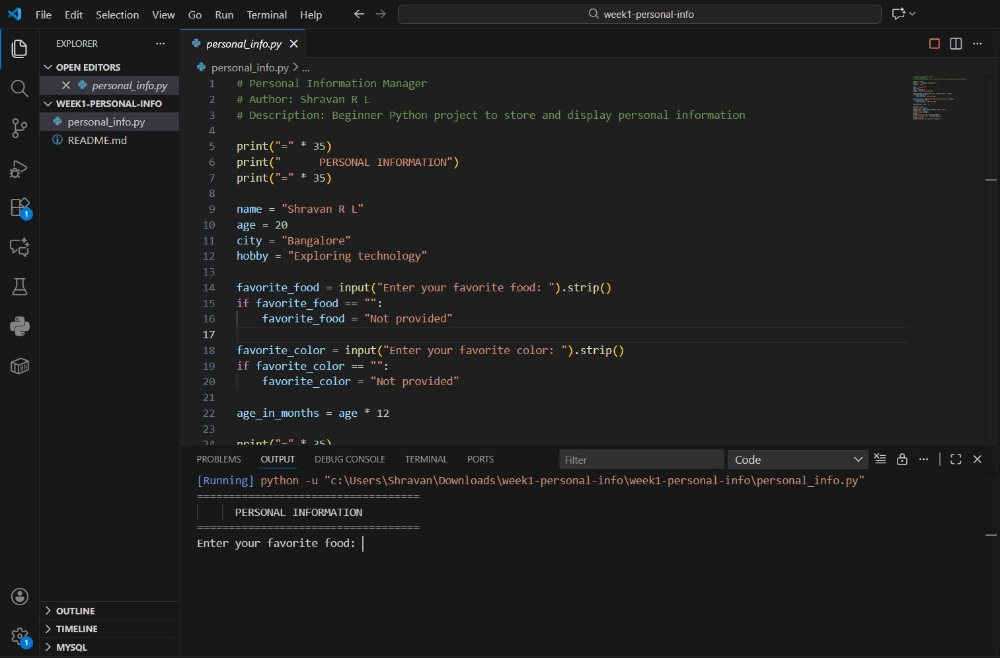

# Personal Information Manager

## Project Description
This is my first Python project! It's a program that stores and displays personal information.

## What I Learned
1. Variables
2. Input/Output
3. String Formatting using f-strings
4. Basic error handling

## How to Run This Program
1. Install Python
2. Open terminal
3. Navigate to project folder
4. Run: python personal_info.py

## Features
- Stores static personal information
- Takes user input
- Displays formatted output
- Calculates age in months

## Sample Output
===================================
Name: John Doe
Age: 25 (300 months old)
City: New York
Hobby: Reading
Favorite Food: Pizza
Favorite Color: Blue
===================================
## Setup Instructions
1. Install Python from https://www.python.org
2. Open terminal or command prompt
3. Navigate to the project folder
4. Run the command:

## Screenshots

## Explanation of Requirements
- Used variables to store name, age, city, and hobby
- Used input() to collect favorite food and color
- Applied basic validation for empty input
- Used f-strings for formatted output
- Calculated age in months using age * 12
